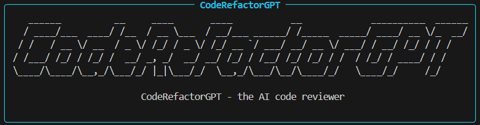
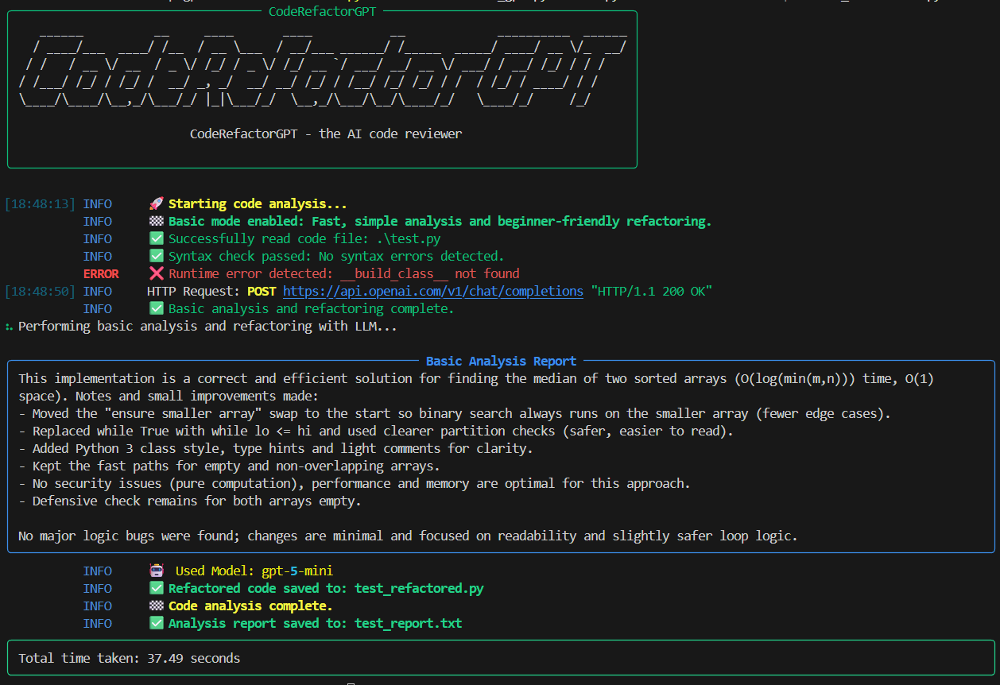
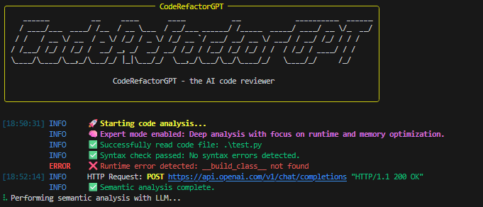
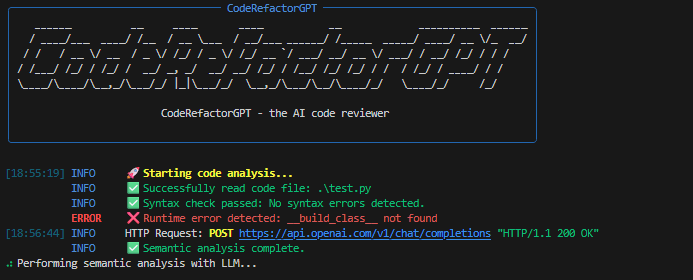

# CodeRefactorGPT 🤖

An intelligent Python code analyzer and refactoring tool powered by GPT language models. It performs comprehensive code analysis and provides smart refactoring suggestions with beautiful, rich terminal output.



## ✨ Features

- � **Multi-level Analysis**
  - Syntax error detection using AST
  - Runtime error checking in a safe environment
  - Deep semantic analysis using AI
- 🎯 **Multiple Operation Modes**
  - Basic Mode: Fast, simple analysis with beginner-friendly changes
  - Expert Mode: Deep analysis focusing on performance optimization
  - Analysis-Only Mode: Code review without modifications
- 🎨 **Rich User Interface**

  - Beautiful colored terminal output
  - Progress indicators for long-running operations
  - Attractive logo display with random colors
  - Detailed analysis reports in panels

- 🤖 **AI-Powered Improvements**

  - Intelligent code refactoring suggestions
  - Performance optimization recommendations
  - Best practices and security tips
  - Code quality improvement hints

- 📊 **Comprehensive Reporting**
  - Detailed analysis reports
  - Execution time tracking
  - Save analysis results to file

## 🛠️ Installation

1. Clone the repository:

```bash
git clone https://github.com/yourusername/CodeRefactorGPT.git
cd CodeRefactorGPT
```

2. Install dependencies:

```bash
pip install -r requirements.txt
```

3. Set up your OpenAI API key:

```bash
# On Windows
set OPENAI_API_KEY=your-api-key-here

# On Linux/Mac
export OPENAI_API_KEY=your-api-key-here
```

## 📚 Usage

### Basic Analysis and Refactoring

For quick, simple improvements:

```bash
python code_analyzer.py your_file.py --basic --refactor-output refactored.py
```



### Expert Analysis

For deep analysis with performance focus:

```bash
python code_analyzer.py your_file.py --expert --refactor-output optimized.py
```



### Analysis Only

To analyze without modifying the code:

```bash
python code_analyzer.py your_file.py
```

(docs/images/analysis_mode2.png)

## 🎯 Command Line Options

| Option              | Description                                             |
| ------------------- | ------------------------------------------------------- |
| `file_path`         | Path to the Python file to analyze (required)           |
| `--refactor-output` | Path to save refactored code (optional)                 |
| `--basic`           | Enable basic mode for simple, beginner-friendly changes |
| `--expert`          | Enable expert mode for deep analysis and optimization   |
| `--llm`             | LLM model to use (e.g., gpt-5, gpt-5-mini)              |
| `--llm-provider`    | LLM provider (default: openai)                          |

## 🎨 Analysis Modes Comparison

### Basic Mode

- ⚡ Quick analysis and simple improvements
- 🎯 Beginner-friendly changes
- 📝 Light documentation additions
- 🔄 Fast turnaround time
- 🤖 Uses gpt-5-mini by default

### Expert Mode

- 🔬 Deep code analysis
- ⚡ Performance optimization focus
- 🧠 Advanced improvement suggestions
- 📊 Detailed recommendations
- 🤖 Uses gpt-5 by default

### Analysis-Only Mode

- 🔍 Code review without modifications
- 📋 Comprehensive analysis report
- 🐛 Identifies potential issues
- 💡 Suggests improvements
- 🤖 Uses gpt-5 by default

## 📋 Output Files

1. **Refactored Code** (when using --refactor-output)

   - Location: Specified by --refactor-output argument
   - Contains: Improved version of your code

2. **Analysis Report**
   - Location: `{input_filename}_report.txt`
   - Contains:
     - Analysis completion time
     - AI semantic analysis
     - Identified issues
     - Improvement suggestions

## 💡 Example Outputs

### Analysis Report

```
✅ Syntax check passed: No syntax errors detected
✅ Runtime check passed: No runtime errors detected
🔍 Semantic analysis complete:
   • Code structure analysis
   • Performance recommendations
   • Security considerations
   • Best practices suggestions
```

### Console Output

- Colorful progress indicators
- Real-time status updates
- Error messages in red
- Success messages in green
- Total execution time
- Random-colored logo display

## 🤝 Contributing

Contributions are welcome! Please feel free to submit a Pull Request. For major changes, please open an issue first to discuss what you would like to change.

## 📜 License

This project is licensed under the MIT License - see the [LICENSE](LICENSE) file for details.

## 🙏 Acknowledgments

- OpenAI for providing GPT models
- Rich library for beautiful terminal formatting
- LangChain for AI integration

---

⭐ If you find this project helpful, please consider giving it a star!
